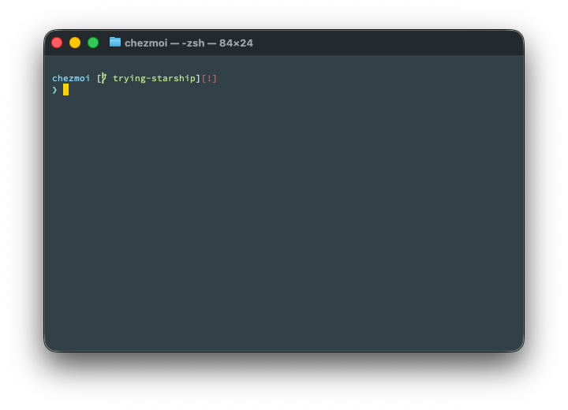

# Dotfiles

This repository contains dotfile configurations managed with [chezmoi](https://www.chezmoi.io/).

## Tools

- [**Starship**](https://starship.rs/) — cross-shell prompt with bracketed-segments preset and Material Theme colors
- [**Neovim**](https://neovim.io/) — editor (`vim`/`vi` aliased)
- [**bat**](https://github.com/sharkdp/bat) — `cat` replacement with syntax highlighting
- [**fzf**](https://github.com/junegunn/fzf) — fuzzy finder
- [**git-delta**](https://github.com/dandavison/delta) — improved git diffs
- [**zsh-autosuggestions**](https://github.com/zsh-users/zsh-autosuggestions) — fish-style command suggestions
- [**zsh-syntax-highlighting**](https://github.com/zsh-users/zsh-syntax-highlighting) — real-time command highlighting
- [**nvm**](https://github.com/nvm-sh/nvm) — Node.js version manager (lazy-loaded)
- [**pyenv**](https://github.com/pyenv/pyenv) — Python version manager
- [**GnuPG**](https://gnupg.org/) + [**pinentry-touchid**](https://github.com/jorgelbg/pinentry-touchid) — GPG signing with Touch ID

## Setup on a New Machine

See https://www.chezmoi.io/quick-start/#set-up-a-new-machine-with-a-single-command

1. Install Homebrew `/bin/bash -c "$(curl -fsSL https://raw.githubusercontent.com/Homebrew/install/HEAD/install.sh)"`
1. Install [`chezmoi`](https://www.chezmoi.io/install/) with `brew install chezmoi`
2. Run `chezmoi init --apply KB1RMA`

## Making Changes

The chezmoi repository is located at `~/.local/share/chezmoi`. To make changes:

1. Edit files in `~/.local/share/chezmoi`
2. Review changes with `chezmoi diff`
3. Apply changes with `chezmoi apply`
4. Commit and push changes to the repository

## Fonts

The terminal is configured to use [SauceCodePro Nerd Font Mono](https://www.nerdfonts.com/font-downloads) (the Nerd Font patched version of Adobe's [Source Code Pro](https://github.com/adobe-fonts/source-code-pro)) for Starship prompt icons. To find a coding font you like, try [codingfont.com](https://www.codingfont.com/) — it lets you compare fonts side-by-side in a tournament-style bracket.